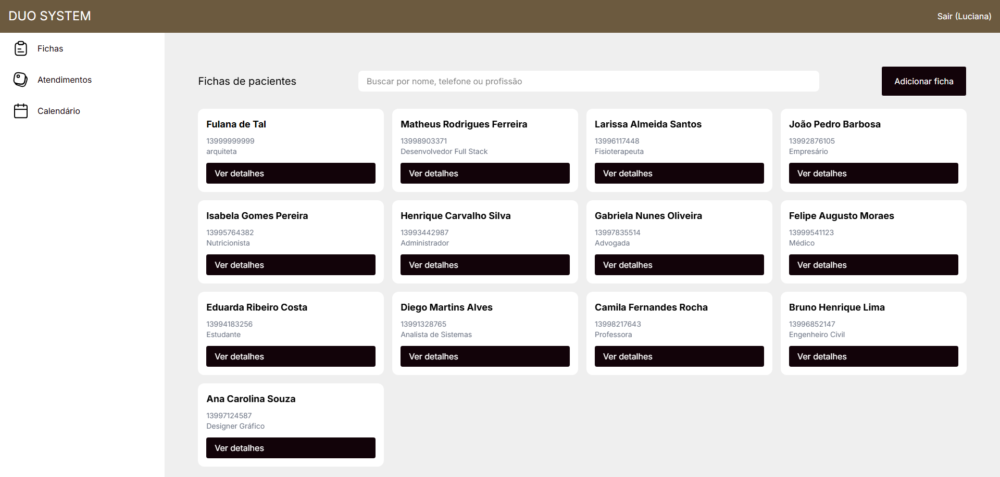
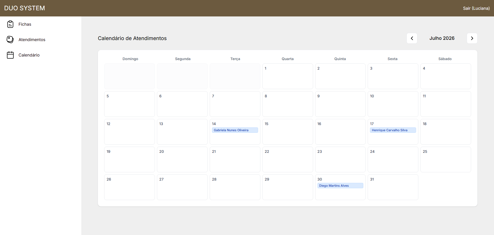

<h1 align="center">
  <br>
  Duo System
  <br>
</h1>

<h4 align="center">Client and appointment management platform for Duo Estética.</h4>

<p align="center">
  
  
  
  
</p>

<p align="center">
  <a href="#-about-the-project">About</a> •
  <a href="#-features">Features</a> •
  <a href="#-layout">Layout</a> •
  <a href="#-how-to-run">How to Run</a> •
  <a href="#-technologies">Technologies</a> •
  <a href="#-author">Author</a>
</p>

## 💻 About the project

**Duo System** is an exclusive system developed to meet the management needs of **Duo Estética**, a clinic specialized in minimally invasive aesthetic procedures. 

The platform was custom-built to provide complete control over the flow of clients, appointments, and to store all attendance history and records in a secure, digital, and accessible way.


## ⚙️ Features

The main features that bring weight and distinction to the project include:

- **👥 Complete Client Management:**
  - Detailed registration and storage of sensitive data.
  - Procedure history and tracking of the client's aesthetic evolution.
- **📅 Appointment and Schedule Management:**
  - Interactive calendar for dynamic control of sessions and consultations.
- **📑 Record and Report Generation:**
  - Automated PDF creation for consent forms and anamnesis records, ready for printing or sending.
- **📊 Administrative Dashboard:**
  - Overview of clinic metrics and quick listing of upcoming appointments.
- **🔒 Robust Security:**
  - User authentication, secure sessions, and advanced protection against CSRF (Cross-Site Request Forgery) attacks.


## 🎨 Layout

The interface was designed aiming for the best user experience (UI/UX), using calm colors and modern elements that refer to the beauty and aesthetics niche. The system is responsive and rich in micro-interactions for a pleasant and fluid navigation.

> *System screenshots*
<br>

<p align="center">
  
  
</p>


## 🚀 How to run

### Prerequisites

Before you begin, you will need to have the following tools installed on your machine:
[Git](https://git-scm.com), [Node.js](https://nodejs.org/en/) and a [MongoDB](https://www.mongodb.com/) database. 
Besides this, it is highly recommended to have a code editor like [VSCode](https://code.visualstudio.com/).

### 🎲 Running the Application

```bash
# Clone this repository
$ git clone https://github.com/enzogran01/duo-system.git

# Access the project folder
$ cd duo-system

# Install Backend dependencies:
$ cd backend
$ npm install

# Create a .env file in the backend folder with your environment variables
# Ex: PORT=3000, MONGO_URI, SESSION_SECRET...

# Run the development server
$ npm run dev

# In a new terminal, install Frontend dependencies:
$ cd ../frontend
$ npm install

# Compile Tailwind CSS styles in watch mode
$ npm run style

# The server will start on the configured port (usually http://localhost:3000)
```


## 🛠 Technologies

The following tools were used in the construction of the project:

### **Frontend**
- **[Tailwind CSS v4](https://tailwindcss.com/)** - Modern and utility-first styling.
- **[EJS (Embedded JavaScript)](https://ejs.co/)** - View rendering.
- **[AOS (Animate On Scroll)](https://michalsnik.github.io/aos/)** - Fluid interface animations.
- **[Tippy.js](https://atomiks.github.io/tippyjs/)** - Elegant tooltips.
- **Vanilla JavaScript** - Interactive client-side logic.

### **Backend**
- **[Node.js](https://nodejs.org/en/)** & **[Express](https://expressjs.com/)** - Server structure and routing.
- **[MongoDB](https://www.mongodb.com/)** & **[Mongoose](https://mongoosejs.com/)** - NoSQL database and data modeling.
- **[PDFKit](https://pdfkit.org/)** - PDF document and term generation.
- **[Bcrypt.js](https://www.npmjs.com/package/bcryptjs)** & **[CSURF](https://www.npmjs.com/package/csurf)** - Security, password hashing, and CSRF protection.


## 📝 License

This project is under the MIT license.


## 👨‍💻 Author

<div align="center">
  <a href="https://github.com/enzogran01">
    
  </a>
  <br />
  <br />

  [](https://github.com/enzogran01)
</div>


## 🌟 Special Thanks

A special thanks to the following users for their help and support in this project:

- [**@Guilherme274**](https://github.com/Guilherme274)
- [**@Cassio-W**](https://github.com/Cassio-W)